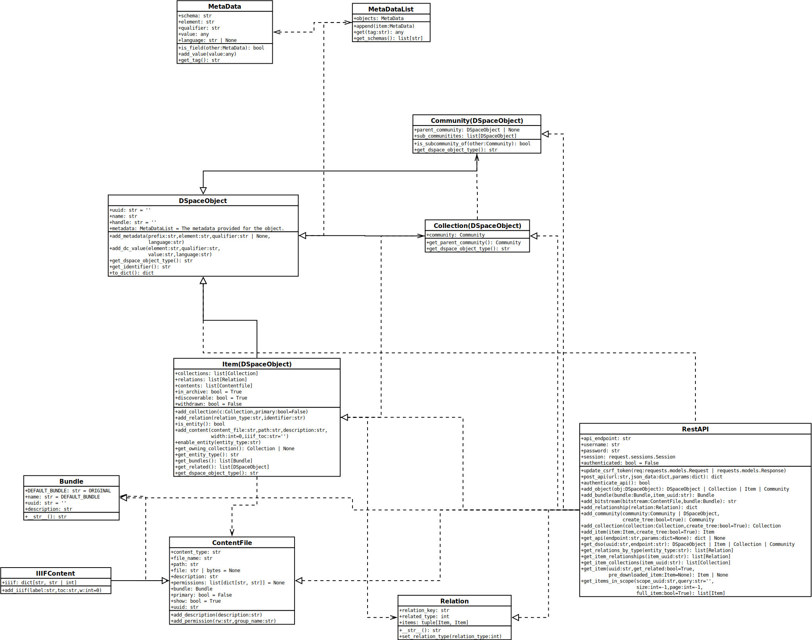

# dspyce
## Description
The package pydspace helps to communicate with dspace interfaces. Currently, 
[saf (Simple Archive Format)](saf) packages and the [RestAPI](rest) are supported.

## Contents
The dspyce packages contains the following classes and packages.

### packages
1. [bitstreams](bitstreams) -> The package for managing DSpace bitstream objects.
2. [metadata](metadata) -> The package manages the handling of DSpace metadata information.
3. [saf](saf) -> The saf packages helps you to create saf packages based on given DSpaceObject objects.
4. [rest](rest) -> The rest packages handles the communication with the RestAPI of a given DSpace instance.

### classes
The following classes exist:
#### 1. [dspyce.DSpaceObject](DSpaceObject.py)
```
class DSpaceObject(builtins.object)
 |  DSpaceObject(uuid: str = '', handle: str = '', name: str = '')
 |  
 |  The class DSpaceObject represents an Object in a DSpace repository, such as Items, Collections, Communities.
 |  
 |  Methods defined here:
 |  
 |  __eq__(self, other)
 |      Return self==value.
 |  
 |  __init__(self, uuid: str = '', handle: str = '', name: str = '')
 |      Creates a new object of the class DSpaceObject
 |      
 |      :param uuid: The uuid of the DSpaceObject. Default is ''
 |      :param handle: The handle of the DSpaceObject. Default is ''
 |      :param name: The name of the DSpaceObject, if existing.
 |  
 |  __str__(self)
 |      Return str(self).
 |  
 |  add_dc_value(self, element: str, qualifier: str | None, value: str, language: str = None)
 |      Creates a new dc- metadata field with the given value.
 |      
 |      :param element: Type of the metadata-field. For example 'title'.
 |      :param qualifier: The qualifier of the field.
 |      :param value: The value of the metadata-field.
 |      :param language: The language of the metadata field. Default: None.
 |  
 |  add_metadata(self, prefix: str, element: str, qualifier: str | None, value: str, language: str = None)
 |      Creates a new metadata field with the given value. The schema is specified through the prefix parameter.
 |      
 |      :param element: Type of the metadata-field. For example 'title'.
 |      :param value: The value of the metadata-field.
 |      :param prefix: The prefix of the schema, which should be used.
 |      :param qualifier: The qualifier of the field.
 |      :param language: The language of the metadata field.
 |  
 |  get_dspace_object_type(self) -> str
 |      This Function serves mainly to be overwritten by subclasses to get the type of DSpaceObject.
 |  
 |  get_identifier(self) -> str
 |      Returns the identifier of this object. Preferably this will be the uuid, but if this, does not exist, it uses
 |      the handle.
 |      :return: The identifier as a string.
 |  
 |  get_metadata_values(self, tag: str) -> list
 |      Retrieves the metadata values of a specific tag as a list.
 |      
 |      :param tag: The metadata tag: prefix.element.qualifier
 |      :return: The values as a list.
 |  
 |  to_dict(self) -> dict
 |      Converts the curent item object to a dictionary object containing all available metadata.
```
#### 2. [dspyce.Community](Community.py)
```
class Community(dspyce.DSpaceObject.DSpaceObject)
 |  Community(uuid: str = '', handle: str = '', name: str = '', parent_community: dspyce.DSpaceObject.DSpaceObject = None, sub_communities: list[dspyce.DSpaceObject.DSpaceObject] = None)
 |  
 |  Method resolution order:
 |      Community
 |      dspyce.DSpaceObject.DSpaceObject
 |      builtins.object
 |  
 |  Methods defined here:
 |  
 |  __init__(self, uuid: str = '', handle: str = '', name: str = '', parent_community: dspyce.DSpaceObject.DSpaceObject = None, sub_communities: list[dspyce.DSpaceObject.DSpaceObject] = None)
 |      Creates a new object of the class DSpaceObject
 |      
 |      :param uuid: The uuid of the DSpaceObject. Default is ''
 |      :param handle: The handle of the DSpaceObject. Default is ''
 |      :param name: The name of the DSpaceObject, if existing.
 |  
 |  get_dspace_object_type(self) -> str
 |      This Function serves mainly to be overwritten by subclasses to get the type of DSpaceObject.
 |  
 |  is_subcommunity_of(self, other) -> bool
 |      Checks if the community object is a sub-community of the given community.
 |      :param other: Another community object.
 |      :return: True, if self is in other.sub_communities.
```
#### 3. [dspyce.Collection](Collection.py)
```
class Collection(dspyce.DSpaceObject.DSpaceObject)
 |  Collection(uuid: str = '', handle: str = '', name: str = '', community: dspyce.Community.Community = None)
 |  
 |  Method resolution order:
 |      Collection
 |      dspyce.DSpaceObject.DSpaceObject
 |      builtins.object
 |  
 |  Methods defined here:
 |  
 |  __init__(self, uuid: str = '', handle: str = '', name: str = '', community: dspyce.Community.Community = None)
 |      Creates a new object of the class DSpaceObject
 |      
 |      :param uuid: The uuid of the DSpaceObject. Default is ''
 |      :param handle: The handle of the DSpaceObject. Default is ''
 |      :param name: The name of the DSpaceObject, if existing.
 |  
 |  get_dspace_object_type(self) -> str
 |      This Function serves mainly to be overwritten by subclasses to get the type of DSpaceObject.
 |  
 |  get_parent_community(self) -> dspyce.Community.Community
```
#### 4. [dspyce.Item](Item.py)
```
class Item(dspyce.DSpaceObject.DSpaceObject)
 |  Item(uuid: str = '', handle: str = '', name: str = '', collections: dspyce.Collection.Collection | list[dspyce.Collection.Collection] | str = None)
 |  
 |  Method resolution order:
 |      Item
 |      dspyce.DSpaceObject.DSpaceObject
 |      builtins.object
 |  
 |  Methods defined here:
 |  
 |  __init__(self, uuid: str = '', handle: str = '', name: str = '', collections: dspyce.Collection.Collection | list[dspyce.Collection.Collection] | str = None)
 |      Creates a new object of the Item class.
 |      
 |      :param uuid: The uuid of the Item.
 |      :param handle: The handle of the Item.
 |      :param name: The name of the DSpace Item, if existing.
 |      :param collections: Collections connected to this item. The first collection in the list will be the owning
 |      collection. Just an uuid can also be provided.
 |  
 |  __str__(self)
 |      Creates a string representation of the item object.
 |  
 |  add_collection(self, c: dspyce.Collection.Collection, primary: bool = False)
 |      Adds an owning collection to the item. If primary is True, the collection will be set as the owning collection.
 |      :param c:
 |      :param primary:
 |      :return:
 |  
 |  add_content(self, content_file: str, path: str, description: str = '', bundle: str = '', permissions: list[tuple[str, str]] = None, iiif: bool = False, width: int = 0, iiif_toc: str = '')
 |      Adds additional content-files to the item.
 |      
 |      :param content_file: The name of the document, which should be added.
 |      :param path: The path where to find the document.
 |      :param description: A description of the content file.
 |      :param bundle: The bundle where the item is stored in.
 |      :param permissions: Add permissions to a content file. This variable expects a list of tuples containing the
 |      permission-type and the group name to which it is granted to.
 |      :param iiif: If the bitstream should be treated as an iiif-specific file. If true also "dspace.iiif.enabled"
 |      will be set to "true".
 |      :param width: The width of an image. Only needed, if the file is a jpg, wich should be reduced and iiif is True.
 |      :param iiif_toc: A toc information for an iiif-specific bitstream.
 |  
 |  add_relation(self, relation_type: str, identifier: str)
 |      Adds a new relation to another item. Only possible if `is_entity()==True`.
 |      
 |      :param relation_type: The name of the relationship
 |      :param identifier: The identifier of the related Item.
 |      :return: None
 |  
 |  enable_entity(self, entity_type: str)
 |      Enables an item to be a dspace-entity by providing an entity-type.
 |      
 |      :param entity_type: The type of the entity.
 |  
 |  get_bundles(self) -> list[dspyce.bitstreams.Bundle.Bundle]
 |      Returns the bundles used by this item.
 |  
 |  get_dspace_object_type(self) -> str
 |      This Function serves mainly to be overwritten by subclasses to get the type of DSpaceObject.
 |  
 |  get_entity_type(self) -> str | None
 |      Checks if the item is a DSpace-Entity and returns the value of dspace.entity.type if true, if not it returns
 |      None.
 |      
 |      :return: The entity type as a string, if existing, else None.
 |  
 |  get_owning_collection(self) -> dspyce.Collection.Collection | None
 |      Provides the owning collection of the item, if existing.
 |      
 |      :return: The collection object of the owning collection or None.
 |  
 |  get_related(self) -> list[dspyce.DSpaceObject.DSpaceObject]
 |      If this Item is an entity. This method will return a list of related items. If not the list will be empty.
 |      
 |      :return: A list of DSpaceObjects (Items)
 |  
 |  is_entity(self) -> bool
 |      Checks if the item is a DSpace-Entity (True, if the metadata field dspace.entity.type is not empty).
 |      
 |      :return: True, if the Item is an entity.
```
### UML Diagramm:

The following class diagramm is the basis of the package:



## Requirements
Requirements are defined in [requirements.txt](requirements.txt), to use the package a python
version >= 3.10 is necessary.
> python >= 3.10
```shell
pip install -r requirements.txt
```

