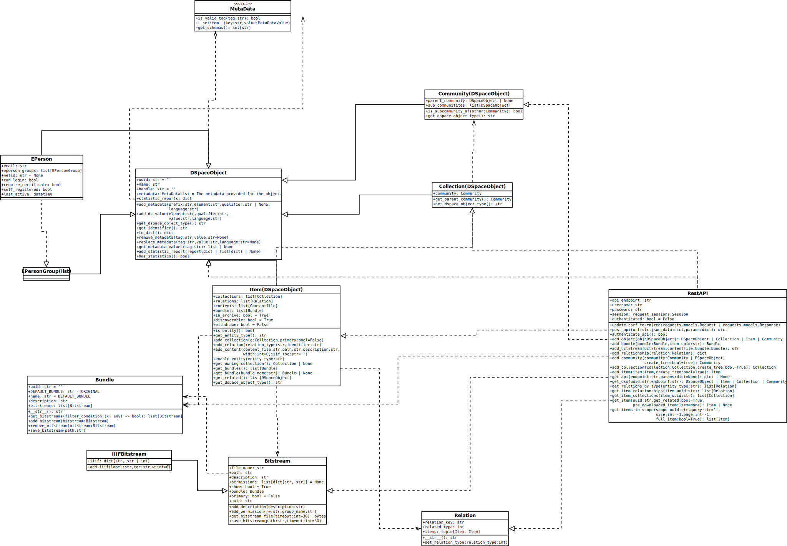

# pydspace
The package pydspace helps to communicate with dspace interfaces. Currently, the only existing way is using
[saf (Simple Archive Format)](saf).

Requirements are defined in [requirements.txt](requirements.txt), to use the package a python
version >= 3.10 is necessary.
> python >= 3.10

The following class diagramm is the basis of the package:

